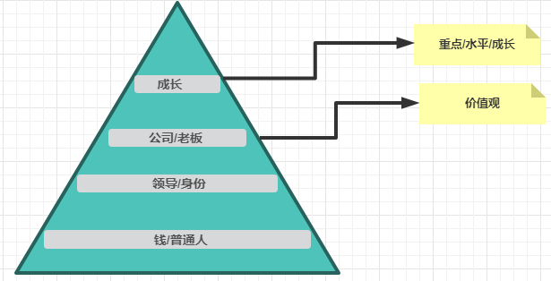
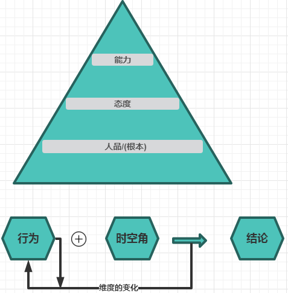

## 一 好的行为习惯
* 做出来
* 写出来 
* 讲出来
### 一切的问题都是人的问题,一切人的问题都是自生的问题,技术可以改变梦想，也可以改变生活，但是关键是改变谁的梦想，成就谁生活

## 二 提升自己的六大途径
* 读万卷书
* 行万里路
* 工作忙碌
* 阅人无数
* 名师指路
* 自己开路
## 三 获取知识的方法
### 站在多维视角考虑问题
> 例如：  行人--司机   员工--老板 

## 四 思考的层次,思考的模型
> 哲学(10W+信仰-马列注意-坚持做正确的事情-革命-和过去决裂)     
> 理论(6-10W-OSI模型)    
> 方法(3-5W-怎么做)    
> 技能(1-2W-做什么)   

<pre>
人的幸福来源俩点
没有欲望
解放财富
追求:开心 快了 幸福 
</pre>

## 五 高薪必备
### 5.1 个人

### 5.2 公司

## 六 影响高薪的因素

> 成长   
> 人品 能力 态度 价值      
> 认知和格局(行为不变，能变化时空角就是格局)

## 七 是什么影响我们的认知和格局
> 7.1 性格(会左右我们的选择)

* 7.1.1 目录(分解到周，没有目标一切的行为都没有意义)
* 7.1.2 方法
* 7.1.3 努力
* 7.1.4 坚持         

> 7.2 环境

* 7.2.1 家庭 
* 7.2.2 学校 
* 7.2.3 社会

## 八 如何思考才可以成功(x-s)
* 8.1 精神--信仰
* 8.2 身份
* 8.3 信念+价值观-->潜意识
* 8.4 能力-->潜意识
* 8.5 行为+时空角
* 8.6 环境

## 九 十一 种需求
* 生理
* 物资
* 重要性
* 赞美和鼓励
* 成长
* 安全
* 美
* 情感
* 自由
* 好奇
* 空间